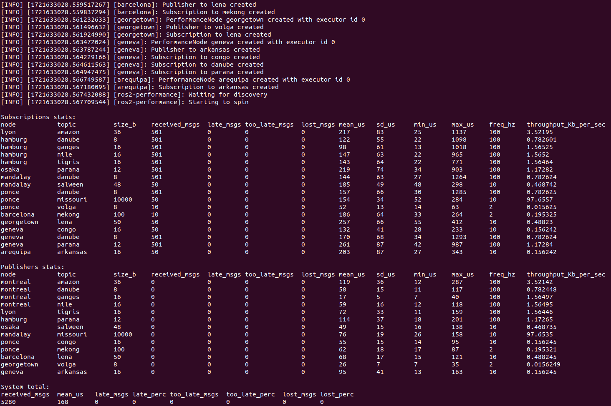

# irobot ros2 perf eval package 的测试和评估
本文参考[ros2-performance的官方说明](https://github.com/irobot-ros/ros2-performance/blob/rolling/README.md)进行测试和评估，详细内容参照链接
## env
- ROS2 Humble
- ubuntu 22.04 LTS

## build
请确保在编译前，机器支持Python3，CMake 和 colon

由于该包是针对ROS2 Rolling 开发的，其中涉及到`rclcpp::experimental::EventsExecutor`的内容，在最新的`rclcpp`中，已经删除了`rclcpp::experimental`下的`EventsExecutor`内容，需要hack操作。
改动如下
```shell
diff --git a/performance_test/src/executors.cpp b/performance_test/src/executors.cpp
index 5e58f24..822e6c9 100644
--- a/performance_test/src/executors.cpp
+++ b/performance_test/src/executors.cpp
@@ -50,12 +50,14 @@ std::shared_ptr<rclcpp::Executor> make_executor(ExecutorType type)
     case ExecutorType::STATIC_SINGLE_THREADED_EXECUTOR:
       executor = std::make_shared<rclcpp::executors::StaticSingleThreadedExecutor>();
       break;
-    case ExecutorType::EVENTS_EXECUTOR:
-      executor = std::make_shared<rclcpp::experimental::executors::EventsExecutor>();
-      break;
     case ExecutorType::MULTI_THREAD_EXECUTOR:
       executor = std::make_shared<rclcpp::executors::MultiThreadedExecutor>();
       break;
+    default:
+      throw std::runtime_error("Unsupported ExecutorType");
   }

   return executor;
```
build cmd
```shell
mkdir -p ~/performance_ws/src
cd ~/performance_ws/src
git clone https://github.com/irobot-ros/ros2-performance
cd ros2-performance
git submodule update --init --recursive
cd ../..
colcon build
```
## Run

[irobot_benchmark package](https://github.com/irobot-ros/ros2-performance/tree/rolling/irobot_benchmark)包含用于评估的图形拓扑的主要应用和示例。 
```shell
source ~/performance_ws/install/setup.bash
cd ~/performance_ws/install/irobot_benchmark/lib/irobot_benchmark
./irobot_benchmark topology/sierra_nevada.json
```
结果将被打印到屏幕上，并保存在目录`./sierra_nevada_log` 中。


## 扩展性能框架并测试自己的系统
`irobot_benchmark/topology`包含一些可用于定义系统的 json 文件示例。
如果要创建自己的 "JSON topology"，请按照[如何创建新拓扑的说明](https://github.com/irobot-ros/ros2-performance/blob/rolling/performance_test_factory/create_new_topology.md)进行操作。 如果要在topology中使用自定义 ROS 2 消息接口，则应查看[performance_test_plugin_cmake](https://github.com/irobot-ros/ros2-performance/blob/rolling/performance_test_plugin_cmake)
### 框架结构
performance_test：此包提供了类，该类提供了用于轻松添加发布者、订阅、客户端和服务的 API，并监视通信的性能。 此外，该类允许同时启动多个节点，同时确保它们相互发现，并监控整个系统的性能。 此外，此 pacakge 包含用于可视化应用程序性能的脚本。performance_test::PerformanceNodeperformance_test::System
performance_metrics：提供工具来测量和记录 ROS 2 系统中的各种性能相关指标。
performance_test_msgs：此包包含包直接用于衡量性能的基本接口定义。performance_test
performance_test_factory：此包提供了可用于根据运行时提供的一些参数创建具有特定发布者和订阅的对象的类：这可以通过 JSON 文件或命令行选项来完成。 可以在这些节点中使用的接口（msg 和 srv）必须在所谓的 .performance_test_factory::TemplateFactoryperformance_test::PerformanceNodeperformance_test_factory_plugins
performance_test_plugin_cmake：此包提供了用于从接口定义生成工厂插件的 CMake 函数。
irobot_interfaces_plugin：此软件包提供 iRobot 系统拓扑中使用的所有接口。performance_test_factory_plugin
irobot_benchmark：此软件包提供了我们的主要基准测试应用程序。 此可执行文件可以加载一个或多个 json 拓扑，并从每个拓扑中创建一个在特定进程中运行的 ROS2 系统。 它还包含示例 json 拓扑。
composition_benchmark：此软件包包含可用于分析 ROS 2 组合概念的应用程序和工具。

## 

